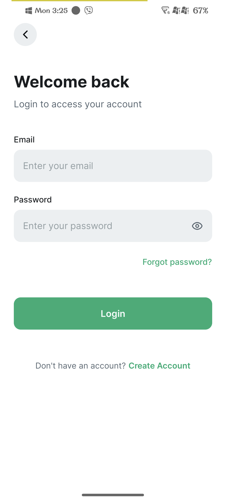
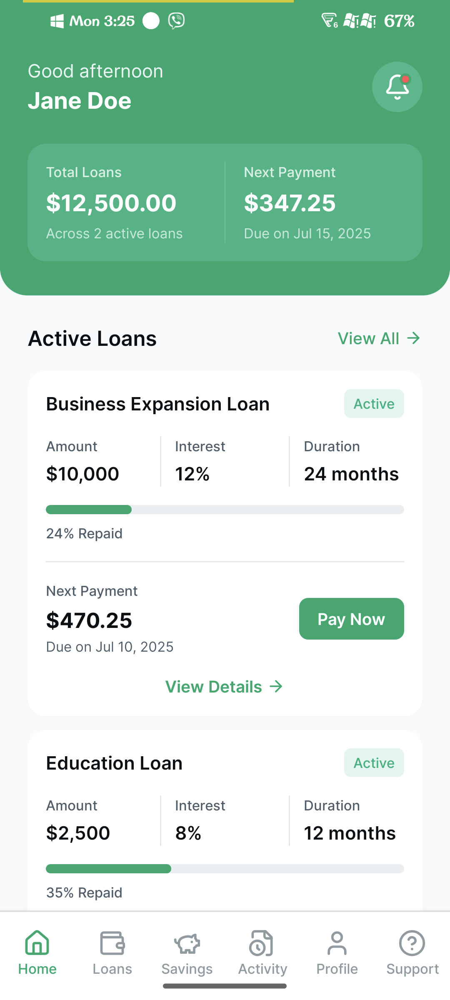
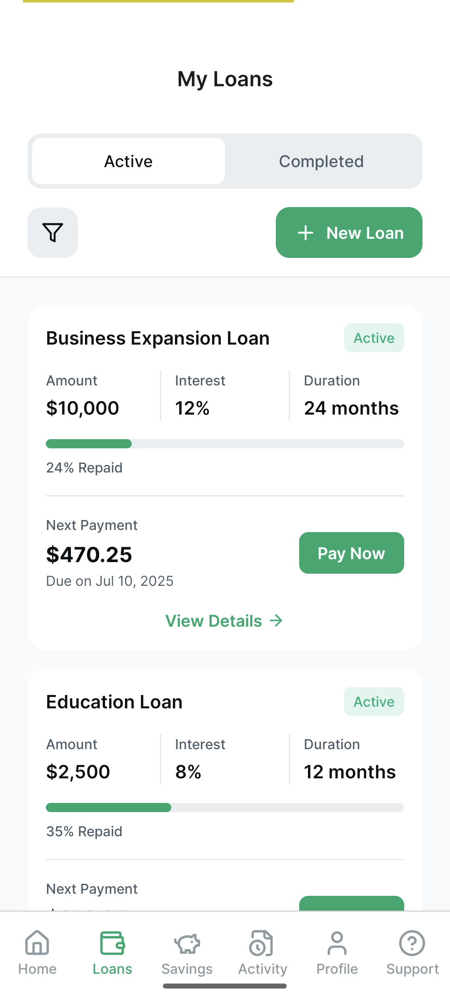
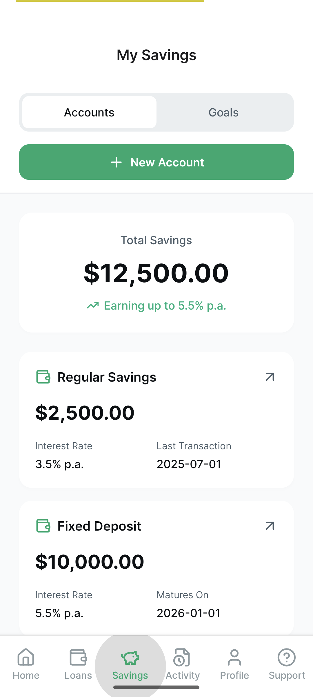
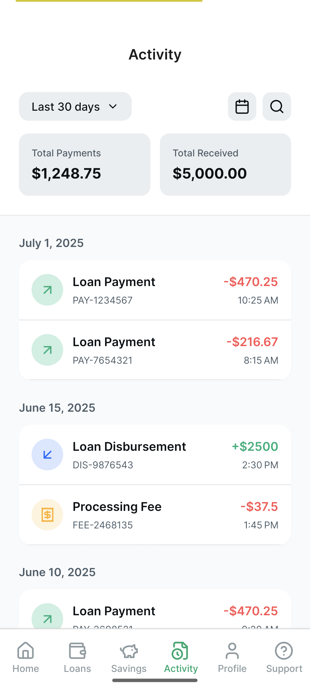
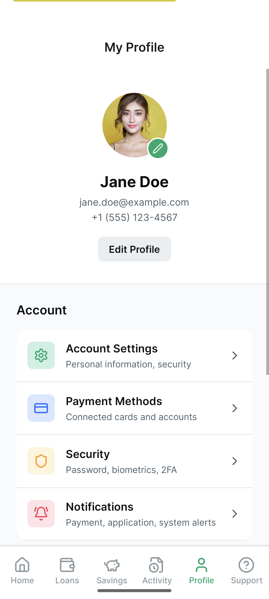
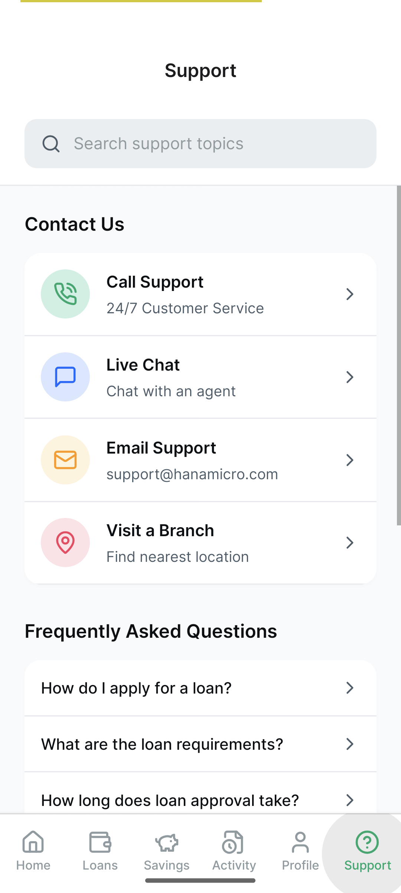

# Hana Client App

A mobile application built with React Native and Expo for managing personal finances, including transactions, savings, and loans.

## Features

- User authentication (login, register, forgot password)
- View transaction history
- Track savings
- Manage loans
- User profile

## Technologies Used

- React Native
- Expo
- TypeScript

## Setup and Installation

1.  **Clone the repository:**

    ```bash
    git clone <repository_url>
    cd hana-client-app
    ```

2.  **Install dependencies:**

    ```bash
    npm install
    # or using bun
    bun install
    ```

## Running the Application

To run the application in development mode:

```bash
npm run dev
# or using bun
bun dev
```

This will start the Expo development server. You can then open the app on your physical device using the Expo Go app or in a simulator/emulator.

## Project Structure

```
.
├── app/                  # Application screens and navigation
│   ├── (auth)/           # Authentication flow screens
│   ├── (tabs)/           # Tabbed navigation screens
│   └── _layout.tsx       # Root layout and navigation setup
├── assets/               # Static assets like images
├── components/           # Reusable UI components
│   ├── loans/
│   └── transactions/
├── constants/            # Application constants (e.g., colors)
├── data/                 # Mock data or data handling logic
├── hooks/                # Custom React hooks
├── types/                # TypeScript type definitions
├── .gitignore            # Specifies intentionally untracked files
├── .npmrc                # npm configuration
├── .prettierrc           # Prettier configuration
├── app.json              # Expo configuration
├── bun.lock              # bun lock file
├── expo-env.d.ts         # Expo environment types
├── package-lock.json     # npm lock file
├── package.json          # Project dependencies and scripts
├── tsconfig.json         # TypeScript configuration
└── README.md             # Project README file
```

## Screenshots

<div style="display: flex; flex-wrap: wrap; gap: 10px;">
  
  
  
  
  
  
  
  
</div>

## License

[Specify your license here, e.g., MIT]
